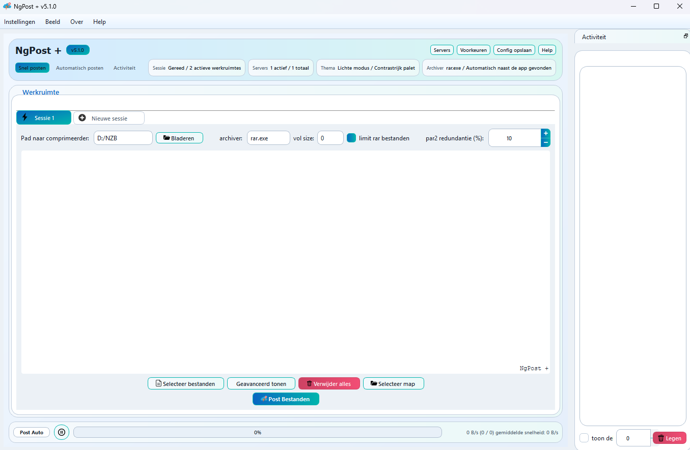



# ngPost+

Modern, performance-focused Qt 6 fork of ngPost for reliable Usenet posting.
Based on the original ngPost project by Max Bruel, with fixes, refinements and enhancements.

Current version: `v5.1.1` (Qt 6)

## Highlights
- Faster, cleaner Qt 6 port with updated build and installer scripts.
- Improved usability for posting workflows and password handling.
- Better UI scaling behavior at non-integer DPI (notably 123% and 150%).
- More robust config persistence and credential handling.
- `par2.exe` bundled in the Qt 6 distribution.

## Differences vs original ngPost
- Qt 6 build chain and updated packaging scripts.
- Consistent behavior for advanced options in posting screens.
- Clearer distinction between global and per-post passwords.
- Fixes for credentials that begin with `0`.
- UI scaling and layout refinements.

## Feature Set
- Quick Post and Auto Post workflows.
- NZB output path control and post-command hooks.
- Optional folder monitoring with extension filters.
- Optional shutdown action after posting.
- SOCKS5 proxy support.
- Multilingual UI (EN, DE, NL, FR, ES, PT, ZH).

## What's new in v5.1.1
- `Geavanceerd tonen` stays remembered per screen (Quick/Auto Post).
- Per-post archive password toggle is now persisted independently.
- Default archive password in Preferences is off unless explicitly enabled.
- Clearer terminology for fixed vs per-post passwords.
- Bugfix: credentials starting with `0` are preserved.
- More reliable persistence for related preference toggles.
- Improved scaling behavior, especially at 123% and 150%.
- Advanced toggle remains readable on higher scales.
- Cleaner Quick/Auto Post advanced panel layout.
- `par2.exe` is bundled and linked to the GUI `%` setting.
- Qt 6 build script forces a clean rebuild for version/resource updates.

## Screenshots

## Build (Windows)
1. Install Qt 6.8.x + MSVC 2022.
2. Run `build-qt6.ps1`.

## Installer (Windows)
1. Install Inno Setup 6.
2. Optional: set `ISCC_PATH` to the path of `ISCC.exe`.
3. Run `build-installers.ps1`.

## Configuration
- Template: `ngPost.conf.example`
- Local config (ignored by git): `ngPost.conf`

## Release Notes
- `release.md`

## License
- See `LICENSE`.

## Credits
- Original project by Max Bruel.

---

# ngPost+ (NL)

Moderne, performance-gerichte Qt 6-fork van ngPost voor betrouwbare Usenet-posting.
Gebaseerd op het originele ngPost-project van Max Bruel, met fixes, verfijningen en verbeteringen.

Huidige versie: `v5.1.1` (Qt 6)

## Highlights
- Snelle, strakke Qt 6-port met geüpdatete build- en installer-scripts.
- Verbeterde usability voor post-workflows en wachtwoordgedrag.
- Betere schaalbaarheid van de UI bij niet-hele DPI-waarden (o.a. 123% en 150%).
- Betrouwbaardere config-opslag en credential-handling.
- `par2.exe` standaard meegeleverd in de Qt 6-distributie.

## Verschillen t.o.v. originele ngPost
- Qt 6 build-chain en geüpdatete packaging-scripts.
- Consistent gedrag van geavanceerde opties in posting-schermen.
- Duidelijkere scheiding tussen globale en per-post wachtwoorden.
- Fixes voor credentials die met `0` beginnen.
- UI-schaal en layout-verfijningen.

## Mogelijkheden
- Snel posten en Automatisch posten workflows.
- NZB-outputpad en post-commands/hooks.
- Optionele folder-monitoring met extensie-filters.
- Optionele shutdown-actie na klaar-met-posten.
- SOCKS5-proxy ondersteuning.
- Meertalige UI (EN, DE, NL, FR, ES, PT, ZH).

## Nieuw in v5.1.1
- `Geavanceerd tonen` wordt per scherm onthouden (Snel/Automatisch posten).
- Per-post archiefwachtwoord-toggle wordt apart bewaard.
- Standaard archiefwachtwoord in Voorkeuren staat uit tenzij expliciet aangezet.
- Duidelijkere terminologie voor vaste vs per-post wachtwoorden.
- Bugfix: credentials die met `0` beginnen blijven bewaard.
- Betrouwbaardere opslag van gerelateerde voorkeuren.
- Verbeterde schaalfunctie, vooral bij 123% en 150%.
- Geavanceerd-toggle blijft leesbaar op hogere schalen.
- Rustiger layout van de geavanceerde blokken in Snel/Automatisch posten.
- `par2.exe` is meegeleverd en gekoppeld aan de GUI-`%`-instelling.
- Qt 6-buildscript doet een schone rebuild bij versie/resource-updates.

## Screenshots

## Build (Windows)
1. Installeer Qt 6.8.x + MSVC 2022.
2. Run `build-qt6.ps1`.

## Installer (Windows)
1. Installeer Inno Setup 6.
2. Optioneel: zet `ISCC_PATH` naar het pad van `ISCC.exe`.
3. Run `build-installers.ps1`.

## Configuratie
- Template: `ngPost.conf.example`
- Lokale config (niet in git): `ngPost.conf`

## Release notes
- `release.md`

## License
- Zie `LICENSE`.

## Credits
- Origineel project door Max Bruel.